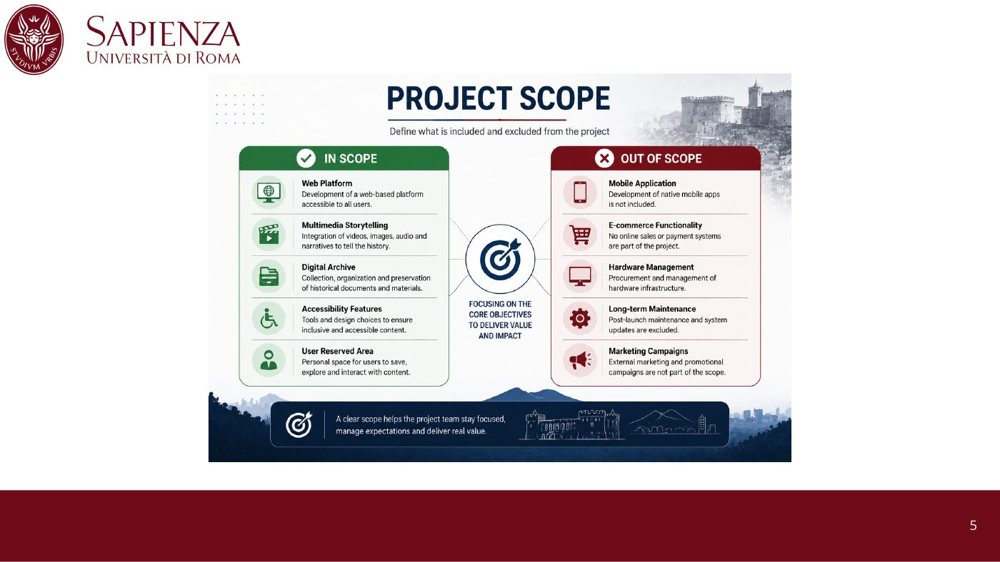

# Napoli Liberazione – Project Management Case Study

**Project management analysis of a real software project**: *Napoli Liberazione*, a digital platform that preserves the memory of the **Four Days of Naples** (September 1943) through multimedia storytelling, a digital archive and accessibility features. The platform was developed by **Partenope Project Lab** for **Graf S.R.L.** under the **TOCC** public funding programme.

Team project (4 people) for the *Project Management* course, Sapienza University of Rome (A.Y. 2025/2026). We reconstructed and critically evaluated the project's whole lifecycle, from business case to closure.

---

## The project at a glance

| | |
|---|---|
| **Output** | Web platform with multimedia storytelling, digital archive, AI-assisted search, accessibility features and a user area |
| **Client / contractor** | Graf S.R.L. / Partenope Project Lab |
| **Funding** | TOCC public programme for cultural and creative enterprises |
| **Duration** | About 7 months (January – July 2024) |
| **Budget** | About €57,000. Cost from timesheets: **€56,940** (€60 margin) |
| **Approach** | Hybrid, Agile-inspired: overlapping phases, progress (SAL) meetings with the client |
| **Outcome** | Full technical scope delivered **on time and within budget** |

## What we analysed

**1. Goals and context**
Business case, **project charter**, SMART objectives, constraints and flexibility, milestones and deliverables.

**2. Scope and planning**
- Scope statement, acceptance criteria and change-control process
- **Work Breakdown Structure** with work packages, tasks and deliverables
- Reconstructed **Gantt chart** with project phases
- Quality, time, **cost (effort-based)**, human-resources, procurement, stakeholder and communication management plans
- **Reconstructed RACI matrix** and roles
- **Risk register**

**3. Execution and control**
Scope, quality, schedule, cost, risk, procurement, team, stakeholder and communication control, each with the problems found and the corrective actions taken.

The key event: an **externally hired senior developer** delivered late and below the required quality. The team protected schedule and budget with **crashing and fast-tracking**: an internal developer was reassigned to support and rework the external components, while the client was kept fully informed.

**4. Closure and critical evaluation**
Critical success factors, **lessons learned** and improvement proposals:
- Treat outsourced work as a **first-class risk**, with clear acceptance criteria and checkpoints
- Keep a **contingency reserve**: a €60 margin leaves no room for surprises
- Formalise what the team did informally: a written risk register, a RACI matrix and a change log

> *"The project succeeded thanks to the execution resilience of the internal team, not the perfection of the initial plan."*

## Methods and tools

Business case · project charter · SMART goals · WBS · Gantt · effort-based cost planning · RACI matrix · risk register · stakeholder map · crashing and fast-tracking · lessons learned (PMBOK-style knowledge areas)

## Documents

- [Full report – 71 pages (PDF)](docs/report.pdf)
- [Presentation (PDF)](docs/presentation.pdf)

## Team

Team 400: Mirco Soriano · Hanna Vollmo Oster · Johan Sjölin · **Bogdan Andrei Tutuianu** ([@bogX2](https://github.com/bogX2))
